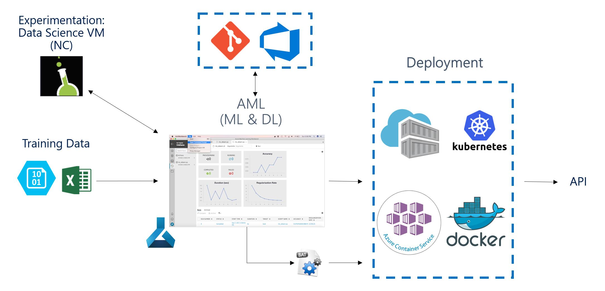

# RIB & MS CSE AI Hackfest on NLP

This repo is for RIB & MS CSE AI hackfest on calculating the similarity of words (phrases, sentences) into MTWO construction system.
# Tasks
## Task1 - API Deployment + Integration

## Task2 - NLP Model Optimization

# Reference
* A selection of AI sessions from the Microsoft Build conference
[channel9 BRK3202 https://channel9.msdn.com/Events/Build/2018/BRK3202](https://channel9.msdn.com/Events/Build/2018/BRK3202)
[channel9 BRK3226 https://channel9.msdn.com/Events/Build/2018/BRK3226](https://channel9.msdn.com/Events/Build/2018/BRK3226)
[channel9 BRK3222 https://channel9.msdn.com/Events/Build/2018/BRK3222](https://channel9.msdn.com/Events/Build/2018/BRK3222)
[channel9 BRK3216 https://channel9.msdn.com/Events/Build/2018/BRK3216](https://channel9.msdn.com/Events/Build/2018/BRK3216)
[channel9 BRK3213 https://channel9.msdn.com/Events/Build/2018/BRK3213](https://channel9.msdn.com/Events/Build/2018/BRK3213)

* Microsoft professional programme for AI
[https://academy.microsoft.com/en-us/tracks/artificial-intelligence](https://academy.microsoft.com/en-us/tracks/artificial-intelligence)
[NLP course - https://www.edx.org/course/natural-language-processing-nlp](https://www.edx.org/course/natural-language-processing-nlp)[https://www.microsoft.com/en-us/research/wp-content/uploads/2016/02/cikm2013_DSSM_fullversion.pdf](https://www.microsoft.com/en-us/research/wp-content/uploads/2016/02/cikm2013_DSSM_fullversion.pdf)

* [Med2Vec](https://github.com/mp2893/med2vec)
* [Word2Vec](https://code.google.com/p/word2vec/)